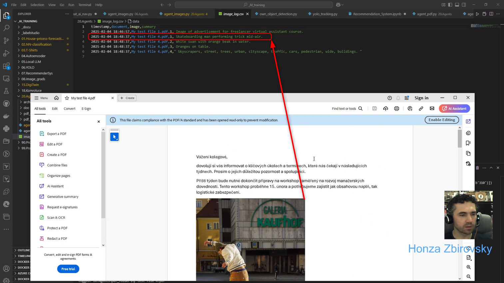

# OllamaAgent
Demonstration of OllamaAgent made completely from scratch in Python. This is just a show case, how such agents can be implemented.

## 1. Ollama installation
Please follow [these steps](https://github.com/ollama/ollama) to install Ollama server on your device. After installation we will be using following to models to demonstrate agent functionality:
- **Mistral** - to work with text part of the file (can be of course replaced by any other model based on your own preferences, e.g. by **DeepSeek-R1**)
- **Llava** - to work with images in our PDF files

## 2. Agents
**The first agent** (Model: **Mistral**) simply looks into a user-defined folder and will search for PDF files. The agent is programmed to take only the information about main events and respective due dates and store them in following format to CSV file:

|Time stamp|PDF file name|Event|
|---|---|---|
|dd.mm.yyyy|file.pdf|"Date, Event name 1"|
|dd.mm.yyyy|file.pdf|"Date, Event name 2"|
|dd.mm.yyyy|...|"..., ..."|

**The second agent** (Model: **Llava**) looks into the same folder searching the same files, but this time agent works just with all the images stored in our PDF files. Agent gives us here a brief description for every image found. It's also stored in similar format to CSV files as shown below:

|Time stamp|PDF file name|Image|Description|
|---|---|---|---|
|dd.mm.yyyy|file.pdf|Image 1|Image description|
|dd.mm.yyyy|file.pdf|Image 2|Image description|
|dd.mm.yyyy|...|...|...|

Here is an example of output generated by this agent:

